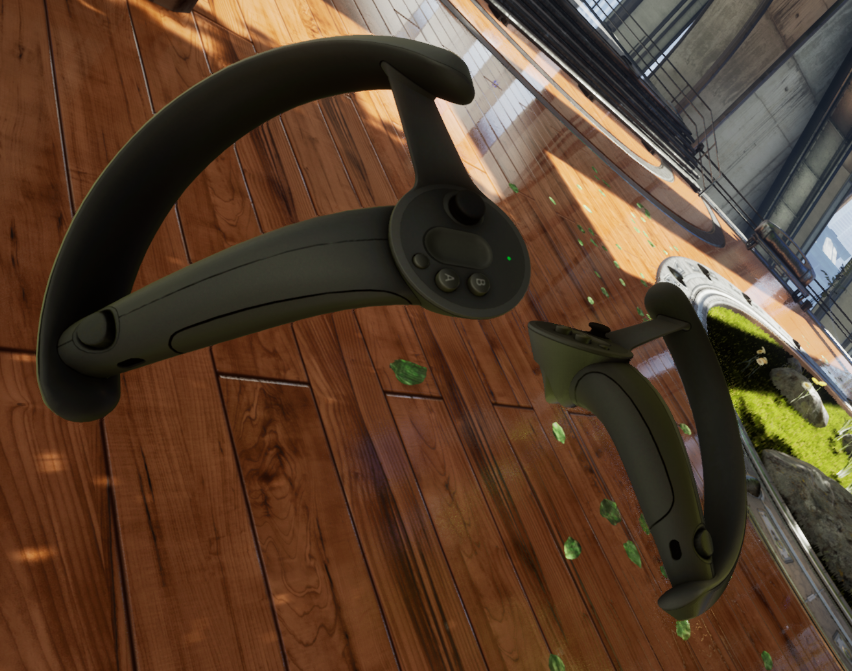

# Valve Index Controllers Ready to Use in Unreal Engine 4

Models and textures these .uassets are made of are downloaded from https://sketchfab.com/F53 where, by the time of writing this file, are distributed under CC BY 4.0 https://creativecommons.org/licenses/by/4.0/

Meshes have been imported to Blender and exported with different rotation to fbx format so it could be imported and conveniently used in Unreal Engine.

Materials have been created from diffuse and specular textures mentioned above in Unreal Engine.

Tested in Unreal Engine 4.25.4

## Installation

Simply copy the whole content of uasset folder anywhere into your {project_directory}/Content folder.